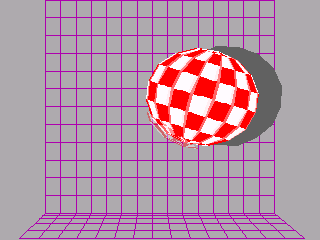

# boingTI84P

A faithful port of the AMIGA Boing Ball demo for the TI-84 Plus CE calculator series.

## Setup

### To run:

You'll need:
- A TI-84 Plus CE series calculator,
- [the TI Connect CE software](https://education.ti.com/en/products/computer-software/ti-connect-ce-sw), 
- [the shared CE libraries](https://tiny.cc/clibs) (`clibs.8xg`), and
- a copy of this program (`BOING.8xp`).

All that's needed is to copy the shared libraries and the program over to the calculator.
- If your calculator has a OS version of 5.50+, you'll need [arTIfiCE](https://yvantt.github.io/arTIfiCE/) to restore the ability to run native programs on the system (which was patched out of the OS on these versions).

### To build:

You'll need:
- [The CE Toolchain](https://ce-programming.github.io/toolchain/static/getting-started.html), and
- a local clone of this repo.

All that's needed is to run `make` to build the program; the resulting binary will be placed in `bin/BOING.8xp`.

## Licensing

This program is licensed under the [MIT license](LICENSE.md).
 
##
conhlee 2025
